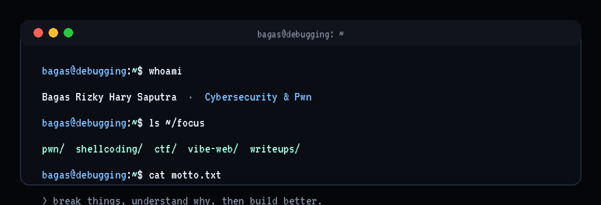
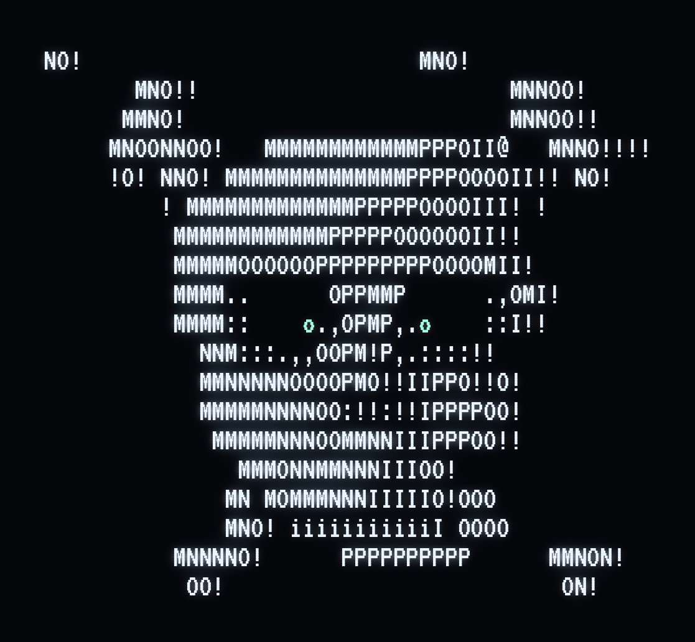

# Bagas Rizky Hary Saputra

**aka `De13ugg1ng`** · Cybersecurity · CTF Player · Binary Exploitation (Pwn)

---

## // about

I'm a student who lives somewhere between **offensive security** and **building things**. On one side I spend my time in capture-the-flag competitions doing **binary exploitation** — stack overflows, shellcoding, GOT overwrites, `ret2win`, format strings — and writing up every challenge I solve. On the other side I ship **web apps**: React, Next.js, Vue, and whatever the idea in front of me needs.

Most of what I know started from curiosity: taking something apart, breaking it on purpose, and then rebuilding it cleaner. That loop is the whole game.

>  The portfolio is a **CRT/terminal themed** single-page app (Vue 3 + Vite) with a full writeup reader — and yes, it has a floating radial nav and a tracking-eyes ASCII skull. → **<https://bagasrizkyharysaputra.vercel.app>**

---

## // arsenal

<b>Pwn toolbox</b> &nbsp; pwntools · gdb + pwndbg · Ghidra / IDA · checksec · ROPgadget · one_gadget

---

## // featured projects

| Project | What it is | Built with |
| --- | --- | --- |
|  **[The Cosmic Journey](https://the-cosmic-journey.vercel.app/)** | Space-themed site (planets, missions, astronomy events) — a school project turned visual playground. | React |
|  **[Web Admin RFID](https://web-admin-gilt.vercel.app/)** | Attendance monitoring dashboard for an IoT project. | Next.js |
|  **[Web Siswa](https://web-siswa-ten.vercel.app/)** | Student-facing companion app to Web Admin, with tighter data access. | Next.js |
|  **[Vibein](https://vibein.work.gd/)** | Marketplace dashboard for API keys — auth, store, key management, tutorials, profile, settings. | React + Vite |
|  **[SIAPIN](https://github.com/BagasRizkyHarySaputra/SIAPIN)** | Digital tutoring platform for SNBT/TKA prep — 2,158 questions, university-chance estimates for 75 campuses, AI ability radar, leaderboard. Digital Innovation Competition entry. | Next.js · React · TypeScript · Tailwind · Prisma · SQLite |
|  **[MLBB on Waydroid](https://github.com/BagasRizkyHarySaputra/MLBB-waydroid-LinuxCloudMLBB)** | Scripts/configs to run Mobile Legends on Linux via Waydroid, with a Sunshine + Moonlight cloud-gaming mode. | Bash |

---

## // trophy case

|  | Placement | Event |
| :-: | --- | --- |
|  | **1st Place** | **CYBREAK 2026** (ITS) |
|  | **2nd Place** | **SCTF 2026** (DCSC) |
|  | **2nd Place** | **WRECKIT7.0 Junior CTF 2026** |
|  | **Best Writeup** | **WRECKIT7.0 Junior CTF 2026** (BSSN) |

---

## // writeups

CTF & pwn notes, mirrored from my HackMD notebooks into the portfolio's in-site reader:

| Writeup | Focus |
| --- | --- |
| **[Shellcoding](https://hackmd.io/@axLOw9-VSAqUknv1IORzog/B1qZyJ4-zl)** | Hand-rolled shellcode around an `fgets` blacklist — sysphone, execute, backdoor_anonymous, brainrot & pwnable.tw/start |
| **[TryHackMe — PWN 101](https://hackmd.io/@axLOw9-VSAqUknv1IORzog/SyHMYv0gGe)** | Full room walkthrough: stack overflows → ret2win, format strings, integer bugs |
| **[ACECTF 2025](https://hackmd.io/@axLOw9-VSAqUknv1IORzog/rJ6Fl3dmGe)** | ACECTF 2025 binary exploitation set, dissected step by step |
| **[LKSN 2026 — PWN](https://hackmd.io/@axLOw9-VSAqUknv1IORzog/SkOyFJIIfe)** | another1 & another2 — GOT-overwrite arithmetic and canary/base leaks |

 Read them all, fully rendered with images, at <a href="https://bagasrizkyharysaputra.vercel.app/#/writeups"><b>bagasrizkyharysaputra.vercel.app/#/writeups</b></a>

---

## // stats

<picture>
  <source media="(prefers-color-scheme: dark)" srcset="https://raw.githubusercontent.com/BagasRizkyHarySaputra/BagasRizkyHarySaputra/output/snake.svg" />
  <source media="(prefers-color-scheme: light)" srcset="https://raw.githubusercontent.com/BagasRizkyHarySaputra/BagasRizkyHarySaputra/output/snake.svg" />
  
</picture>

---

## // connect

Discord <code>bagas7.</code> &nbsp;·&nbsp; open to CTF teams, collabs, and a good challenge.

  

<code>exit 0</code>

